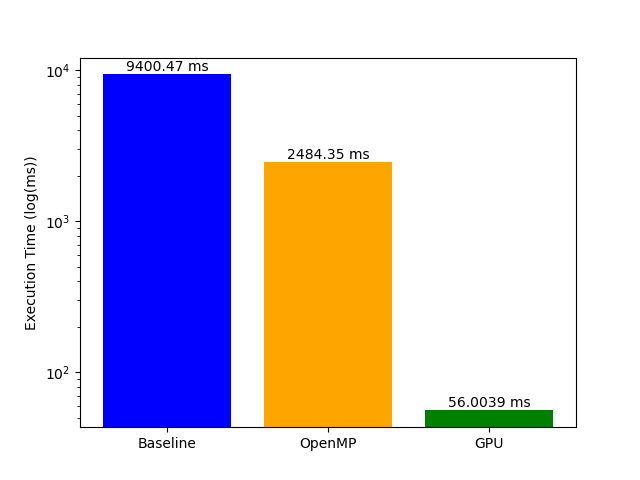

# Particle Simulation with OpenMP and CUDA

This repository contains the code for my final project in CS759: High-Performance Computing at UW–Madison. The project explores efficient strategies for simulating particle motion under gravity (the N-Body problem) using sequential CPU, multi-threaded CPU (OpenMP), and GPU (CUDA) approaches.

## Overview

For detailed methodology, results, and discussion, see [Report.pdf](./Report.pdf).

The project evaluates the computational performance of different simulation strategies and demonstrates the resulting speedups. It also includes a virtual reality (VR) application that visualizes the simulation in 3D, allowing users to explore particle dynamics interactively.

Key components:

• Sequential CPU simulation – baseline implementation.

• OpenMP multi-threaded simulation – CPU parallelization.

• CUDA GPU simulation – fully GPU-accelerated computation.

• VR visualization – 3D representation of particle positions and densities.

## Visualizations

More visualizations can be found in the Videos directory.

## Performance Results

Here are the final timing results:

</img>

The results demonstrate substantial speedups using GPU acceleration compared to single-threaded CPU execution, with OpenMP providing intermediate improvements.

## Limitations and Future Work

While this project demonstrates the performance benefits of parallel CPU and GPU simulations, there are a few limitations and opportunities for improvement:

• Limited collision handling: Current collisions are handled simplistically; more physically accurate models could improve realism.

• Single-node computation: The simulations run on one machine. Using MPI could allow distributed simulations across multiple nodes and provide another useful result.

• Floating-point differences: Small numerical differences arise between CPU and GPU results due to parallelization and single-precision calculations.

• Visualization in Unity: Particle visualization in the Unity-based VR application relies on standard GameObject representations. While simple and flexible, this approach does not scale well to very large particle counts, as Unity supports only a limited number of active GameObjects per scene without significant performance degradation. More scalable alternatives—such as GPU instancing, custom meshes, compute-shader–driven rendering, or Unity’s particle systems—could enable visualization of substantially larger simulations. These approaches were not explored due to time constraints.

